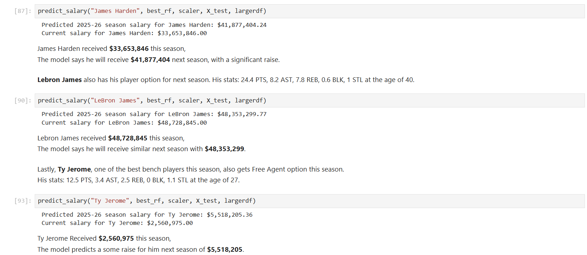

# 🏀 NBA Salary Prediction

This project built three different models to predict NBA player salaries for 2025-2026 season based on traditional per-game statistics.
Through these models, the goal is to explore how traditional stats correlate to player compensation and to build a simple and interpretable salary prediction model!


## 🚀 Getting Started

### Prerequisites

- Python 3.8+

### Required Libraries

- pandas
- numpy
- matplotlib
- seaborn
- scikit-learn
- xgboost
- plotly
- torch

### Running

1. Download both folders (data, notebooks)
2. Open any notebook inside notebooks folder (Linear Regression, Random Forest, or Deep Learning)
3. Run it and try putting any name of current NBA player in the end of the notebook, section called 'Prediction Function'


## 📁 Project Structure

```
NBA_Salary_Prediction/
│
├── images/
├── data/
│   ├── 2022 NBA Team Market Size.csv
│   └── NBA Player Salaries_2000-2025.csv
|   └── NBA Player Salaries_2024-25_1.csv
|   └── NBA Player Stats and Salaries_2000-2025.csv
|   └── NBA Player Stats and Salaries_2010-2025.csv
|   └── NBA Player Stats_1998-2025.csv
|   └── NBA Player Stats_2024-25_Per_Game.csv
│
├── notebooks/
|   ├── NBA Salary Project_DL_Traditional.ipynb
│   └── NBA Salary Project_LR_Traditional.ipynb
│   └── NBA Salary Project_RF_Traditional.ipynb
│
├── NBA Salary Project Data Preparation.ipynb
└── README.md
```


## 🔍 Description & Overview

Three different models were built in this project:
- **Linear Regression model** (NBA Salary Project_LR_Traditional.ipynb)
- **Random Forest model** (NBA Salary Project_RF_Traditional.ipynb)
- **Deep Learning model** (NBA Salary Project_DL_Traditional.ipynb)

Each model used different sets of features from different timeframe and scale of data. All three models try to predict a player's salary for 2025-26 season as accurate as possible through further tuning and adjustments.


## 📊 Datasets

| Dataset                                      | Description                                              |
| -------------------------------------------- | -------------------------------------------------------- |
| **NBA Player Stats_2024-25_Per_Game.csv** | Per-game stats for the 2024–25 season                    |
| **NBA Player Salaries_2024-25_1.csv**      | Player salaries for 2024–25                              |
| **2022 NBA Team Market Size.csv**            | Market size, metro population, team revenue              |
| **Four Historical Datasets (2000–2025)**          | Stats/Salaries from 2000/2010-2025 |

Full scraping & cleaning scripts are in ```NBA Salary Project Data Preparation.ipynb```.


## 📏 Evaluation Metrics

- **Root Mean Squared Error (RMSE)** measures the model’s prediction error in dollar terms.
- **R-squared (R²)** explains the proportion of variance in salary that is predictable from the features used.

These two metrics help balance interpretability and accuracy in evaluating model performance.


## 🛠️ Methodology

### **1. Data Preparation**
- Collected stats & salaries from 1998–2025
- Merged multiple sources into structured datasets
- Cleaned missing values, standardized columns
- Created two data scopes:
  - **Single season (2024–25)**
  - **Multi-season (2010–25)**

### **2. Feature Selection**
- Dropped features with low salary correlation
- Removed high multicollinearity features (using [VIF](https://www.investopedia.com/terms/v/variance-inflation-factor.asp))
- Final feature sets:
  - **Linear Regression**: PTS, AST, REB, STL, BLK, Age
  - **Random Forest/Deep Learning models**: All features from dataset

### **3. Modeling Approaches**
#### **Linear Regression**
- Used only 2024–25 stats (to minimize outlier distortion)
- Features chosen via correlation + VIF filtering
- **Performance**: RMSE $9.24M, R² 0.526

#### **Random Forest Regression**
- Compared multiple regressors (RF, GBM, XGBoost, Extra Trees)
- RF outperformed others even without tuning
- Best config: 2010–25 data + all features + hyperparameter tuning
- **Performance**: RMSE $4.20M, R² 0.744

#### **Deep Learning (PyTorch)**
- Fully connected neural network
- Trained on 2010–25 data with all features
- 50 epochs, standard scaling
- **Performance**: RMSE $4.93M, R² 0.650
- Results vary slightly between runs (±0.02 R²)


## ⚖️ Comparing Models

| Model             | RMSE           | R-squared (R²)     |
| ----------------- | -------------- | ------------------ |
| Linear Regression | \$9,240,772.81 | 0.5261             |
| Random Forest     | **\$4,199,705.10** | **0.7440**             |
| Deep Learning     | \$4,931,571.61 | 0.6501             |

**Random Forest** model outperforms the others with the lowest RMSE and highest R², indicating strong predictive power and better fit to the data. While Deep Learning also performs well, it slightly underperforms Random Forest in both metrics.


## 📷 Predictions




## 🔗 Links
- [Kaggle- Linear Regression](https://www.kaggle.com/code/ratin21/predicting-nba-salary-through-linear-regression)
- [Kaggle- Random Forest](https://www.kaggle.com/code/ratin21/predicting-nba-salary-through-random-forest)
- [Kaggle- Deep Learning](https://www.kaggle.com/code/ratin21/predicting-nba-salary-through-linear-regression)


## 🙌 References

- [Basketball Reference](https://www.basketball-reference.com/)
- [HoopsHype](https://hoopshype.com/salaries/)
- [HoopSocial](https://hoop-social.com/nba-team-market-size-rankings/)
- [Statista](https://www.statista.com/)
- [Koki Ando](https://www.kaggle.com/koki25ando)

